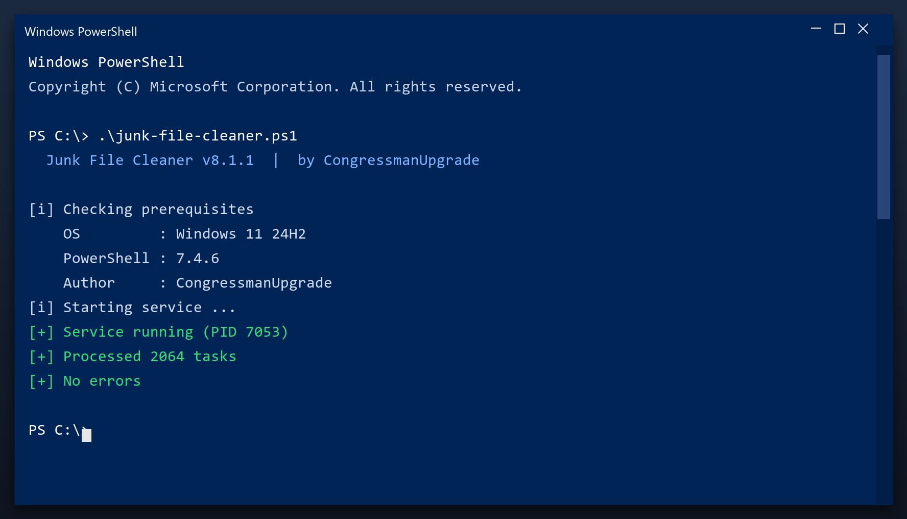

# Junk File Cleaner: Free Download and Guide (2026)

  

**At a glance**

| | |
| --- | --- |
| **Program** | Junk File Cleaner |
| **Version** | Latest 2026 build |
| **Price** | Free |
| **Systems** | see requirements below |
| **Download** | Quick Start section below |

---

**Junk file cleaner** is a maintenance tool for Windows written to be simple: one window, plain settings, no confusing options. Download it, run a scan, done. **Free to use, no strings attached.**

  

## 1. Overview

Think of junk file cleaner as a housekeeper for your computer. Over time, files pile up that nobody uses - installers you ran once, caches, old logs. The tool finds those piles and clears them, which frees space and often speeds the PC up.

| **Term** | **Meaning** |
| --- | --- |
| **Cache** | Saved data that can be rebuilt |
| **Leftover** | A file an uninstall forgot |
| **Duplicate** | The same file stored twice |
| **Free space** | Room available on your drive |

## 2. Technical Details

| **Feature** | **Details** |
| --- | --- |
| **Windows** | 11, 10 (64-bit) |
| **Scan time** | 1-3 minutes |
| **Backup** | Automatic before changes |
| **Memory use** | Very low |
| **Price** | Free |
| **Internet** | Not required to run |

## 3. System Requirements

| **Component** | **Minimum** | **Recommended** |
| --- | --- | --- |
| **OS** | Windows 10 | Windows 11 (64-bit) |
| **RAM** | 2 GB | 4 GB |
| **Disk** | 100 MB free | 500 MB free |
| **Network** | For download | For updates |

## 4. Installation

1. **Download** the tool from this page
2. **Close** your other programs
3. **Launch** it and let it load
4. **Scan** your system
5. **Clean** the results, then reboot

  

> **Note:** make sure your work is saved before a deep clean. The tool creates a restore point, but saving first is always wise.

## 5. What's Included

| **Component** | **Details** |
| --- | --- |
| **Installer** | Single file, no extras |
| **Readme** | Short setup notes |
| **Restore point** | Made automatically |
| **Uninstaller** | Standard Windows removal |

## 6. Comparison

| **Feature** | **Doing it by hand** | **junk file cleaner** |
| --- | --- | --- |
| **Time** | Hours | Minutes |
| **Risk** | Deleting the wrong file | Safe preview first |
| **Knowledge** | Needed | None |
| **Repeatable** | No | Yes, scheduled |

## 7. Common Issues

| **Issue** | **Fix** |
| --- | --- |
| **High CPU during scan** | Expected - it throttles when you use the PC |
| **Antivirus blocks cleanup** | Add an exclusion for the tool |
| **Cleanup leaves temp files** | Some are locked - reboot and rescan |
| **Tool asks for admin** | Approve it so it can clean system areas |

## 8. Maintenance Tips

- Run the first scan with admin rights for full results
- Let it finish - do not close the window mid-scan
- Check the report before removing anything large
- Schedule a weekly scan if you use the PC daily
- Exclude the tool's own folder from antivirus

## 9. Frequently Asked Questions

**Is junk file cleaner free?**

Yes - the full version, no registration and no hidden payments.

**Is it safe?**

The build is scanned and tested. It creates a restore point before making changes.

**Does it work on Windows 11?**

Yes, and on Windows 10 (64-bit).

**Will it delete my files?**

No. It only removes temporary and leftover files, not your documents or photos.

**Do I need the internet?**

Only to download it. After that it works offline.

**Where do I download it?**

Use the green button in the Quick Start section above.

---

*epic-mirage-874 · Updated 2026-10-10 · Shared under the MIT License*
